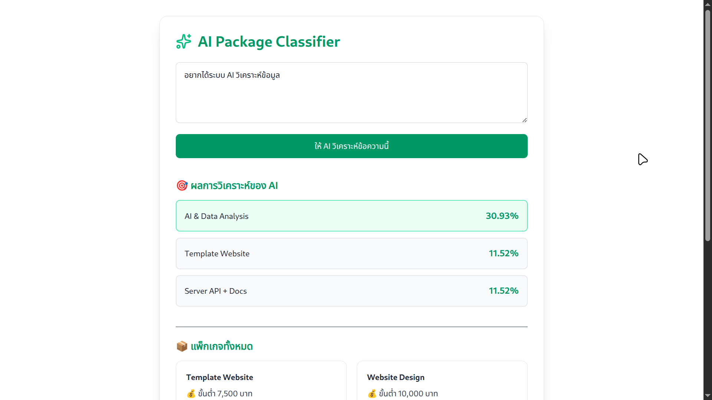

# 🧠 AI Web Template — Run Machine Learning in Browser

> ตัวอย่างโปรเจกต์ที่รันโมเดล Machine Learning (ONNX) โดยตรงในเบราว์เซอร์  
> ไม่ต้องพึ่งเซิร์ฟเวอร์หรือ API ภายนอก ใช้พลังของ WebAssembly ผ่าน `onnxruntime-web`

---


---

## 🧩 Concept Overview

โปรเจกต์นี้ออกแบบมาเพื่อสาธิตการ **นำโมเดล Machine Learning ที่ฝึกจาก Python มารันในเว็บโดยตรง**  
ด้วยเทคโนโลยี **ONNX Runtime Web (onnxruntime-web)** ซึ่งทำงานบน **WebAssembly (WASM)**

### 🌟 จุดเด่น
- รัน inference ได้ทันทีบนเบราว์เซอร์
- ไม่ต้องมี server-side API
- รองรับ offline (เมื่อโหลดโมเดลแล้ว)
- ประมวลผลเร็วด้วย SIMD / Threading
- ปลอดภัย ข้อมูลไม่ออกนอกเครื่องผู้ใช้

---

## 🏗️ Project Structure

```
AI_SUCSAGE/
├── ai_web_template/      # 🌐 Frontend (React + TypeScript + Vite)
│   ├── src/
│   │   ├── components/
│   │   ├── assets/
│   │   ├── App.tsx
│   │   ├── PredictPage.tsx
│   │   └── main.tsx
│   ├── vite.config.ts
│   ├── package.json
│   └── ...
│
├── train_ai/             # 🧠 Backend Training (Python)
│   ├── train2.py
│   ├── test2.py
│   ├── rngtext.py
│   └── requirements.txt
│
├── README.md
└── .gitignore
```

---

## ⚙️ Installation & Setup

### 1️⃣ Frontend (Vite + React + TypeScript)
```bash
cd ai_web_template
npm install
npm run dev
```

เปิดเบราว์เซอร์ที่:
👉 http://localhost:5173

### 2️⃣ Training (Python Model)
```bash
cd train_ai
pip install -r requirements.txt
python train2.py
```

เมื่อฝึกเสร็จ ระบบจะได้ไฟล์ `logreg_tfidf_keyword_model.onnx`  
ให้นำไปวางในโฟลเดอร์ `ai_web_template/public/`  
เพื่อให้เว็บโหลดโมเดลอัตโนมัติ

---

## 🧠 Example Inference (ในเบราว์เซอร์)

```tsx
import * as ort from "onnxruntime-web";

async function runModel(text: string) {
  // โหลดโมเดล ONNX
  const session = await ort.InferenceSession.create("/logreg_tfidf_keyword_model.onnx");

  // แปลง input เป็น tensor
  const inputTensor = new ort.Tensor("string", [text], [1, 1]);

  // รันโมเดล
  const result = await session.run({ input_text: inputTensor });

  console.log("Prediction:", result.output_label.data);
}
```

---

## 💻 Tech Stack

| Layer | Technology |
|-------|-------------|
| Frontend | React + TypeScript + Vite |
| AI Runtime | ONNX Runtime Web (WASM backend) |
| Styling | TailwindCSS |
| Training | Python (scikit-learn, pandas, numpy, ta, finta, etc.) |
| Visualization | Recharts / Lucide Icons |

---

## 📦 Features
✅ รันโมเดล AI ได้ใน Browser โดยตรง  
✅ ไม่มีเซิร์ฟเวอร์ → ต้นทุนต่ำสุด  
✅ ประสิทธิภาพสูงด้วย WebAssembly  
✅ ทำงาน offline ได้หลังโหลดโมเดล  
✅ ใช้ React + TypeScript โครงสร้างชัดเจน  
✅ สามารถต่อยอดเป็น Web AI App อื่น ๆ ได้

---

## 🧩 Example Use Case
- AI วิเคราะห์ข้อความ (Text Classification)
- AI วิเคราะห์รูปภาพ (Image Recognition)
- ระบบแนะนำ (Recommendation)
- ตัวอย่างเว็บสาธิตโมเดล Machine Learning

---

## 📸 Screenshot (แนะนำใส่รูปจริง)
```markdown

```

---

## 🧾 License
Distributed under the **MIT License**.  
See `LICENSE` for more information.

---

## 👨‍💻 Author

**Chalongpat (SAGE)**  
📧 sage20885@gmail.com  
💬 “Building AI that lives in your browser.”

---

## 💡 Tips
- หากรันแล้วขึ้น error เช่น  
  ```
  no available backend found. ERR: [wasm] RuntimeError: Aborted(CompileError: WebAssembly.instantiate()...)
  ```
  ให้ตรวจสอบว่า:
  - ไฟล์ `.onnx` อยู่ใน `/public/`
  - ใช้ HTTPS หรือ localhost (บาง backend ใช้ SharedArrayBuffer ต้องใช้ secure context)

---

⭐ **ขอบคุณที่เข้ามาดูโปรเจกต์นี้!**  
หากคุณชอบแนวคิด “รัน AI ในเบราว์เซอร์” — กด ⭐ บน GitHub เพื่อสนับสนุนได้เลย 💖
